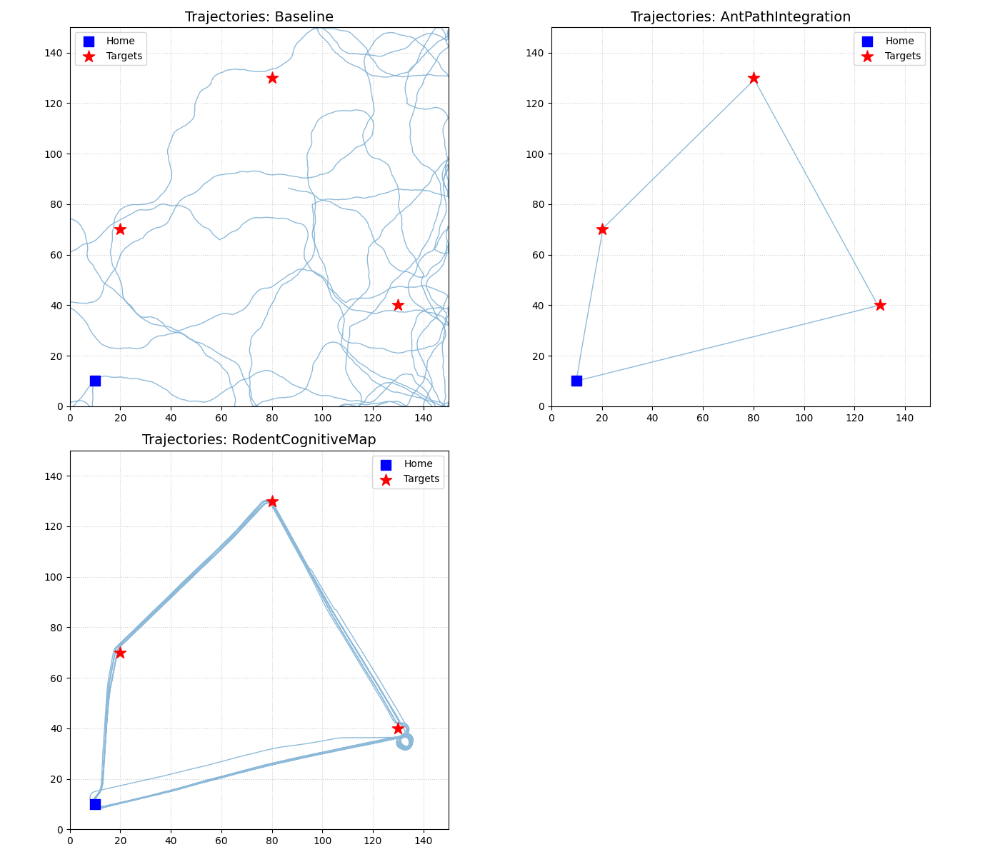

# Neuromorphic Navigation Simulation

## Overview

This project is a Python-based simulation environment for testing and comparing bio-inspired navigation algorithms, based on the principles outlined in the research paper "Neuromorphic Navigation Systems for Autonomous Robots." The simulation implements several navigation strategies, from simple baselines to complex cognitive models.

The project has been enhanced to include complex, continuous foraging tasks to test the long-term stability and efficiency of the advanced models. The primary goal is to generate detailed performance data (in CSV format) to analyze the efficiency, accuracy, and robustness of these neuromorphic strategies.



## Author

* **Chandan Sheikder**

## Features

- **Modular Algorithm Design**: Easily add, modify, or compare different navigation algorithms.
- **Configurable Simulations**: Control environment size, obstacles, targets, and algorithm-specific parameters via a JSON config file.
- **Detailed Data Logging**: Outputs detailed CSV logs with per-step data on position, status, state, energy use, and cumulative drift.
- **Advanced Implemented Algorithms**:
    - **Baseline Search**: A simple random-walk algorithm for performance comparison.
    - **Potential Field Navigator**: Deterministic gradient-based navigation that blends attractive target forces with obstacle repulsion, ideal for ROS2 streaming.
    - **Soft-Body Haptic Glide**: Soft-robot inspired navigator that hugs obstacles via tactile sensing and compliant heading adjustments.
    - **Artificial Chemotaxis**: Chemical gradient following with adaptive trail deposition for robust guidance in dynamic environments.
    - **Neuromorphic Spiking Map**: Population-coded spiking network that fuses goal and boundary cues, echoing neuromorphic processors.
    - **CPG Locomotion**: Central pattern generator producing rhythmic gaits that adapt to terrain feedback.
    - **Swarm Consensus**: Distributed multi-robot coordination using cohesion/alignment/separation rules with shared gradient sensing.
    - **Deep RL Explorer**: Lightweight deep Q-learning agent that adapts online via neural approximators.
    - **Ant Path Integration**: Navigates a multi-target tour and includes a systematic "lost" search behavior to handle accumulated drift.
    - **Bee Swarm Pheromones**: Features a complex multi-agent system with 'Scout' and 'Forager' roles and a recruitment model.
    - **Rodent Cognitive Map**: A sophisticated model with Grid Cells, Place Cells, and Head-Direction Cells, capable of continuous, looped foraging to test long-term navigation.
- **Comprehensive Visualization**: Includes a script to automatically generate multiple plots from the results, including agent trajectories, performance comparisons, and model-specific analytics.

## Project Structure

```
neuromorphic_navigation_project/
|
├── main.py                 # Main script to run simulations
├── README.md               # This file
├── requirements.txt        # Python dependencies
|
├── src/                    # Core simulation logic
│   ├── environment.py      # Simulation environment class
│   ├── robot.py            # Base robot class
│   ├── simulation.py       # Simulation runner and data logger
│   └── utils/
│       └── plotter.py      # Plotting utility
|
├── algorithms/             # Navigation algorithm implementations
│   ├── baseline_nav.py
│   ├── potential_field_nav.py
│   ├── soft_body_haptic_nav.py
│   ├── chemotaxis_nav.py
│   ├── neuromorphic_spiking.py
│   ├── ant_path_integration.py
│   ├── bee_swarm_pheromones.py
│   ├── swarm_consensus.py
│   ├── deep_rl_nav.py
│   ├── cpg_locomotion.py
│   └── rodent_cognitive_map.py
|
├── config/
│   └── simulation_params.json # Simulation parameters
|
└── results/                # Output directory for CSV logs and plots
```

## Setup and Installation

1.  **Ensure Python 3 is installed.**
2.  **Set up the project directory and files** as described in the structure above.
3.  **Navigate to the project's root directory** in your terminal.
4.  **Create and activate a virtual environment:**
    ```bash
    # Use python3 on macOS/Linux
    python3 -m venv venv
    source venv/bin/activate
    ```
5.  **Install the required dependencies:**
    ```bash
    pip install -r requirements.txt
    ```

## How to Run Simulations

From the project's root directory, with your virtual environment activated, run the main script:

```bash
python3 main.py
```

The script will run all simulations sequentially, save the `.csv` log files into the `results/` directory, and generate all comparison plots in the `results/plots/` subdirectory.

To focus on a single algorithm, edit `main.py` and adjust the `algorithms_to_run` list. Each algorithm has a matching key inside `config/simulation_params.json` where you can tweak gains, learning rates, swarm sizes, and chemical diffusion properties.

## Soft-Body Haptic Navigation

The soft-robot inspired controller models a compliant body with distributed tactile probes. Each step it:

- casts a fan of short-range rays to estimate virtual contact forces around the hull;
- blends target-directed motion with wall-following behaviours when contact is detected;
- injects small exploratory noise to escape local minima, mimicking shape reconfiguration.

Configuration keys:

- `sensing_arc` / `num_sensors` – field of view and probe count for tactile rays.
- `sensor_range` – maximum distance for detecting obstacles before contact is assumed.
- `compliance` – how strongly the agent follows surface cues vs. goal direction.
- `orientation_damping` – rate of heading adaptation towards the blended target.
- `contact_bias` – trade-off between pushing away from obstacles and sliding along them.

## Neuromorphic Spiking Navigation

The neuromorphic navigator emulates a population of head-direction and boundary cells. Leaky integrators accumulate evidence until a subset spikes and rotates the agent.

- `num_neurons` – size of the circular population code.
- `membrane_decay` / `refractory_period` – temporal dynamics of the spiking loop.
- `sensory_weight` / `boundary_weight` – how strongly targets or obstacles excite the neurons.

## Swarm Consensus Navigation

The consensus swarm deploys multiple robots with local communication only. Alignment, cohesion, and separation create emergent flow towards the target.

- `num_agents` – number of collaborating robots.
- `neighborhood_radius` – sensing range for peer discovery.
- `cohesion_gain` / `alignment_gain` / `separation_gain` – classic boids-style weights.

## Deep Reinforcement Learning Navigation

The deep RL agent maintains a tiny neural network that updates online via TD-error minimisation. It learns to reduce distance to the goal while avoiding obstacles.

- `hidden_size` – width of the hidden layer.
- `learning_rate` / `gamma` – training hyperparameters for Q-learning.
- `epsilon` / `epsilon_decay` – exploration schedule.

## ROS 2 Bridge

A ROS&nbsp;2 package lives under `ros2_ws/src/neuromorphic_navigation_ros`. It exposes the simulation over ROS topics so you can visualise the runs in RViz or integrate with other robotic stacks.

```bash
cd ros2_ws
source /opt/ros/humble/setup.bash         # or your ROS 2 distribution
colcon build --packages-select neuromorphic_navigation_ros
source install/setup.bash
export NEUROMORPHIC_SIM_ROOT=$(pwd)/..    # point to the Python simulation root
ros2 launch neuromorphic_navigation_ros simulation_bridge.launch.py
```

Published topics:

- `pose` (`geometry_msgs/PoseStamped`) – the latest agent pose.
- `path` (`nav_msgs/Path`) – trajectory accumulated during the run.
- `status` (`std_msgs/String`) – textual summary of algorithm state and energy usage.

Launch parameters:

- `algorithm` – defaults to `PotentialField`, switch to any other algorithm string from `main.py`.
- `config_path` – relative path to the JSON config (defaults to `config/simulation_params.json`).
- `frame_id` – frame used when publishing poses (defaults to `map`).

## Docker Support

Two Dockerfiles are provided under `docker/`:

- `Dockerfile` – lightweight Python image to run the simulations headlessly (`docker build -f docker/Dockerfile -t neuromorphic-sim .`).
- `ros2.Dockerfile` – ROS&nbsp;2 Humble base image that builds the ROS package and launches the bridge (`docker build -f docker/ros2.Dockerfile -t neuromorphic-sim-ros .`).

A helper `docker/docker-compose.yml` exposes two services:

```bash
cd docker
docker compose up simulation          # run the Python-only batch simulations
docker compose up ros2_bridge         # launch ROS 2 bridge (requires host support for GUI tools)
```

When using the ROS container, results are written inside the container at `/workspace/project/results`. Mount volumes as required to access them on the host.

## Understanding the Output

### CSV Log Files

Each simulation produces a CSV file with detailed metrics, including: `step`, `agent_id`, `algorithm`, `x`, `y`, `distance_to_target`, `status`, `state`, `energy_used`, `cumulative_drift`, and `landmarks_discovered`.

### Generated Plots

The `plotter.py` utility will generate five plots:
1.  **Trajectories**: The actual paths taken by the agents.
2.  **Cumulative Drift**: Error accumulation for the Ant and Rodent models.
3.  **Swarm States**: The distribution of Scout vs. Forager agents over time.
4.  **Distance vs. Time**: The convergence rate towards the target.
5.  **Energy Comparison**: A final comparison of the total energy consumed by each algorithm.

## License

This project is licensed under the MIT License.
- `epsilon` / `epsilon_decay` – exploration schedule.

## Artificial Chemotaxis Navigation

The chemotaxis controller senses a diffusing chemical lattice seeded at targets and reinforced by the robot’s own trail. Gradients and obstacle repulsion combine to yield robust guidance even as conditions change.

- `gradient_gain` – how strongly the agent follows the sensed gradient.
- `trail_deposit` – amount of chemical added per step to reinforce successful paths.
- `desensitisation` – rate at which the internal bias adapts to persistent signals.
- `chemical_diffusion_rate` / `chemical_decay_rate` (environment keys) – control the spread and longevity of the virtual chemistry field.

## CPG Locomotion Navigation

The CPG-based navigator maintains coupled oscillators representing left/right virtual limbs. Terrain feedback modulates frequency and phase to produce adaptive, rhythmic motion.

- `base_frequency` – intrinsic oscillator rate.
- `coupling_strength` – synchronisation between oscillators.
- `sensory_gain` / `obstacle_frequency_boost` – how strongly terrain cues reshape the gait.
